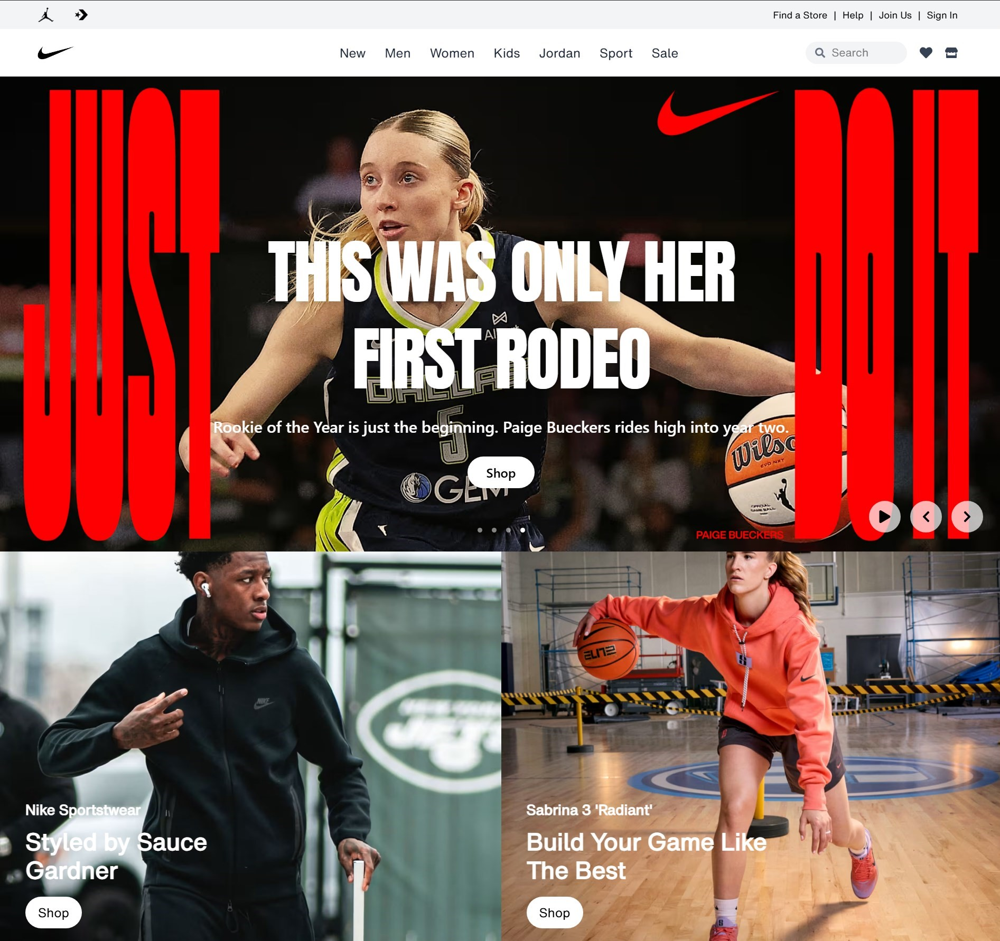

# 🏀 Nike Clone Website

A Nike Landing Page clone built with **React** and **Tailwind CSS**.  
This project replicates the look and feel of the official Nike website, including a **hero carousel**, **navigation bar**, and **footer**.

---

## 🚀 Features
- **Hero carousel** with autoplay, pause/play, navigation, and dot indicators
- Modern **navigation bar** with centered items
- Styled **footer grid** (like Nike official website)
- Smooth hover effects and transitions
- Built using **React** + **Tailwind CSS**

---

## 📸 Preview

## 🛠️ Tech Stack
- [React](https://reactjs.org/) – Frontend library
- [Tailwind CSS](https://tailwindcss.com/) – Utility-first CSS framework
- [React Icons](https://react-icons.github.io/react-icons/) – Icon library

---

## 📌 To-Do / Improvements
- Add product listing page
- Add authentication (login/register)
- Connect with a backend (Node/Express + database)
- Add cart & checkout functionality

---

## 📄 License

This project is for educational purposes only.
All rights for images & trademarks belong to Nike.

